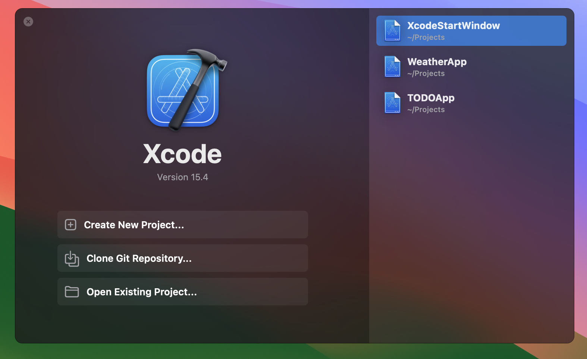

# XcodeStartWindow

XcodeStartWindow is a simple yet effective repository demonstrating how to create a start window in a macOS application using Swift, the Cocoa framework, and SwiftUI. This project is designed to be built and understood in a single day, making it ideal for developers looking to quickly implement a start window in their macOS applications.

## Disclaimer

I have no affiliation with Apple Inc. or their products. This repository is solely for demonstration purposes.
